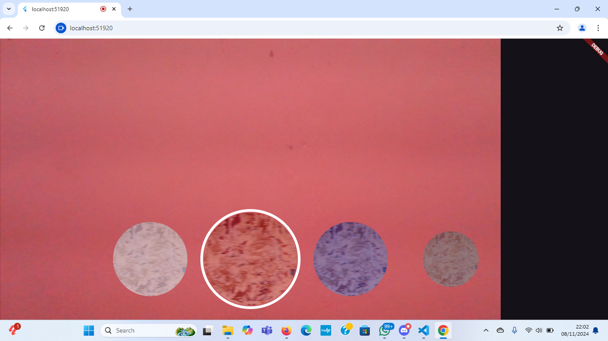

# TUGAS PRAKTIKUM filter_camera

1. Membuat photo filter carousel
Hasil:

2. Jelaskan maksud void async pada praktikum 1?
Jawab: 
void: Kata kunci ini menunjukkan bahwa fungsi tidak mengembalikan nilai apa pun. Jadi, tipe pengembalian dari fungsi tersebut adalah void.
async: Kata kunci ini digunakan untuk menandai bahwa fungsi tersebut adalah fungsi asinkron.
Ketika sebuah fungsi ditandai dengan async, Anda dapat menggunakan kata kunci await di dalam fungsi tersebut untuk menunggu penyelesaian dari operasi asinkron lain. Misalnya, Anda mungkin memiliki fungsi yang mengambil data dari internet, dan Anda ingin menunggu data tersebut sebelum melanjutkan eksekusi kode lainnya.

3. Jelaskan fungsi dari anotasi @immutable dan @override ?
Jawab: 
Fungsi dari Anotasi @immutable dan @override 
# @immutable:
- notasi ini digunakan untuk menandai sebuah kelas sebagai immutable, yang berarti bahwa setelah objek dari kelas tersebut dibuat, objek tersebut tidak dapat diubah.
- Pada Flutter, anotasi ini sering digunakan pada kelas-kelas yang mewakili widget. Karena widget sebaiknya tidak berubah setelah dibuat, menandai kelas dengan @immutable membantu memastikan bahwa semua properti di dalam kelas tersebut bersifat final
# @override:
- Anotasi ini digunakan untuk menunjukkan bahwa sebuah metode atau properti dalam kelas anak (subclass) mengoverride (menggantikan) metode atau properti dengan nama yang sama di kelas induk (superclass).
- Anotasi ini membantu meningkatkan keterbacaan kode dan memastikan bahwa metode yang dioverride benar-benar ada di kelas induk.